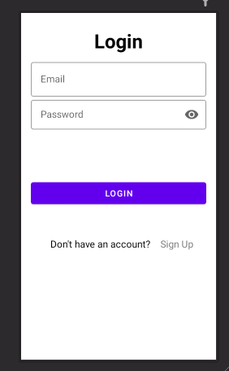
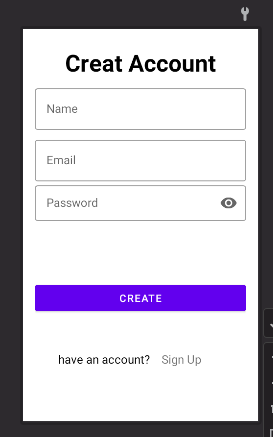
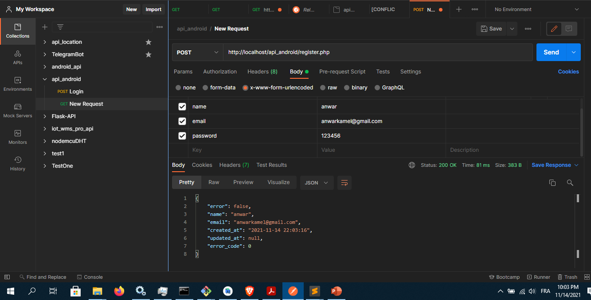

# Techo format Formation Project 

## Introduction
Simple app, Formation android in Techno format School

## Technologies used:
* [Php Api](https://www.mulesoft.com/resources/api/what-is-an-api)
* [Retrofit](https://square.github.io/retrofit/)
* [OkHttp](https://square.github.io/okhttp/) .
* [Postman](https://www.postman.com/) .
* [MySQL](https://www.mysql.com/) .

## Screen

 

 

  

